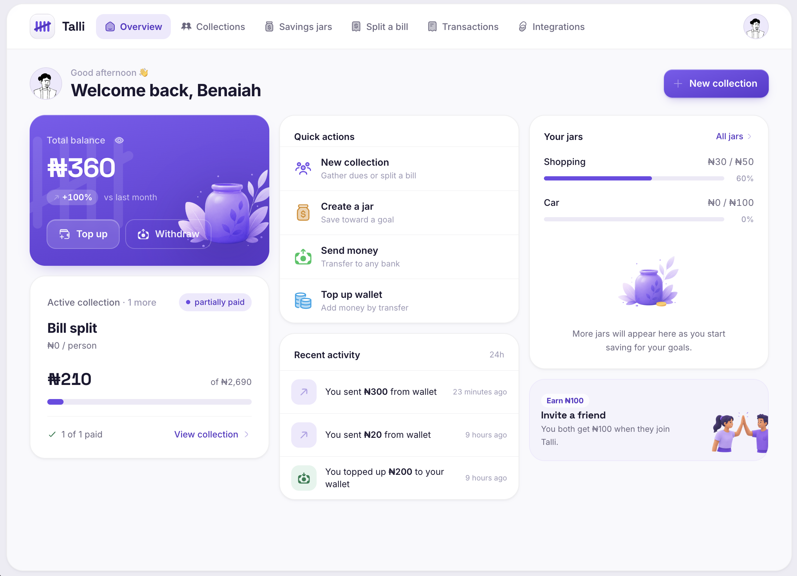

# Talli

AI treasurer and savings assistant for Telegram. Collect money, track payments,
run savings jars, send payouts, and manage group contributions from chat.

**Stack:** Bun + Turborepo · Hono engine · Vite SPA · Prisma + Postgres ·
Nomba · Telegram bot. (WhatsApp is planned — see the PRD.)

Full product spec: [`docs/talli-prd.md`](docs/talli-prd.md) · [`docs/talli-prd-v2.md`](docs/talli-prd-v2.md)

## Prerequisites

Icons come from **`@benrobo/iconary`**, a private package on **GitHub Packages**.
`bun install` will fail without a token, so set one **before installing**:

```bash
# a GitHub token with the `read:packages` scope
export GITHUB_TOKEN=ghp_your_read_packages_token
```

The repo's root [`.npmrc`](.npmrc) reads it as `${GITHUB_TOKEN}` — no secret is
committed. In CI / Vercel, add `GITHUB_TOKEN` as an environment variable. See the
`benrobo-iconary` skill for how to use icons.

## Quick start

```bash
export GITHUB_TOKEN=...   # see Prerequisites (needed for @benrobo/iconary)
bun install

cp .env.example .env
cp services/engine/.env.example services/engine/.env

bun db:migrate
bun dev
```

First run only — start the portless HTTPS proxy once (sudo for port 443):

```bash
sudo portless proxy start --https
```

### Local URLs

| Service | URL |
|---|---|
| Web app | **https://talli.localhost** (portless) |
| Engine API | http://localhost:7291 |

Web dev runs through [portless](https://www.npmjs.com/package/portless) — same
pattern as mood-world. Set `WEB_APP_URL=https://talli.localhost` in
`services/engine/.env` so CORS and auth cookies match.

Leave `VITE_ENGINE_API_URL` empty — the Vite dev server proxies `/api` to the
engine on `:7291`.

Bypass portless: `bun dev:web:no-proxy` → http://localhost:7193

### Cloudflare tunnel (engine / webhooks only)

Only the engine is tunneled for Nomba and Telegram webhooks:

| Hostname | Local target |
|---|---|
| https://p7291.benlabtest.space | Engine `:7291` |

```bash
bun tunnel:push
cloudflared tunnel run my-tunnel
```

```env
PUBLIC_API_URL=https://p7291.benlabtest.space
```

## External setup

| Service | Docs |
|---|---|
| Nomba | [Nomba API](https://developer.nomba.com) |
| Telegram | Create bot via [@BotFather](https://t.me/BotFather) |

## Scripts

```bash
bun dev                  # engine + web (portless) + marketing
bun dev:engine           # engine only
bun dev:web              # web via portless → https://talli.localhost
bun dev:web:no-proxy     # web on http://localhost:7193
bun db:migrate
bun tunnel:push
```

Agent instructions: [`AGENTS.md`](AGENTS.md)
